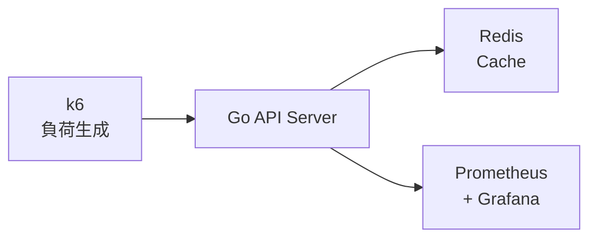

# Singleflight Demo

Cache Stampede（Thundering Herd）問題と、`singleflight` パターンによる解決策をデモンストレーションする環境です。

## Cache Stampede とは？

キャッシュが切れた瞬間に大量のリクエストが同時に到達すると、すべてのリクエストが「キャッシュがない」と判断し、全員がDBに問い合わせてしまう問題です。

```
1,000 Requests → Cache Miss → 1,000 DB Calls → DB過負荷
```

## Singleflight による解決

`singleflight` パターンは、同じキーに対する重複したリクエストを1つにまとめます。

```
1,000 Requests → Cache Miss → Singleflight → 1 DB Call → 結果を共有
```

## アーキテクチャ



## クイックスタート

### 1. 環境起動

```bash
docker compose up -d
```

### 2. Grafana にアクセス

- URL: http://localhost:3000
- ユーザー: `admin`
- パスワード: `admin`
- ダッシュボード: 「Singleflight Demo」を開く

### 3. 負荷テスト実行

**Singleflight 無し（Cache Stampede 発生）:**

```bash
docker compose run --rm k6 run /scripts/without-singleflight.js
```

**Singleflight 有り（リクエスト集約）:**

```bash
docker compose run --rm k6 run /scripts/with-singleflight.js
```

**比較テスト（両方を連続実行）:**

```bash
docker compose run --rm k6 run /scripts/comparison.js
```

### 4. Grafana で結果を確認

- **DB Calls Rate**: Singleflight無しでは多数のDB呼び出しが発生
- **Singleflight Shared Rate**: リクエストが共有された回数
- **Cache Misses Rate**: キャッシュミスの発生率

## エンドポイント

| エンドポイント | 説明 |
|---------------|------|
| `GET /api/without-singleflight` | Singleflight無し（Cache Stampede発生） |
| `GET /api/with-singleflight` | Singleflight有り（リクエスト集約） |
| `GET /api/clear-cache` | キャッシュをクリア |
| `GET /metrics` | Prometheusメトリクス |
| `GET /health` | ヘルスチェック |

## メトリクス

| メトリクス | 説明 |
|-----------|------|
| `cache_hits_total` | キャッシュヒット数 |
| `cache_misses_total` | キャッシュミス数 |
| `db_calls_total` | DBコール数 |
| `singleflight_shared_total` | Singleflightで共有されたリクエスト数 |
| `request_duration_seconds` | リクエスト処理時間 |

## 期待される結果

100同時リクエストでキャッシュクリア直後の場合:

| メトリクス | Without Singleflight | With Singleflight |
|-----------|---------------------|-------------------|
| DB Calls | ~100 | ~1 |
| Cache Miss | 100 | 100 |
| Singleflight Shared | 0 | ~99 |

## 実験手順（デモ用）

### 準備

```bash
# 環境起動
docker compose up -d

# 起動確認
curl http://localhost:8080/health
```

### 実験1: Singleflight無し（Cache Stampede発生）

```bash
# 負荷テスト実行（100同時リクエスト）
docker compose run --rm k6 run /scripts/without-singleflight.js

# メトリクス確認
curl -s http://localhost:8080/metrics | grep db_calls_total
```

**結果例:**
```
db_calls_total{endpoint="without_singleflight"} 100
```
→ 100リクエストに対して100回DBアクセスが発生

### 実験2: Singleflight有り（リクエスト集約）

```bash
# 負荷テスト実行（100同時リクエスト）
docker compose run --rm k6 run /scripts/with-singleflight.js

# メトリクス確認
curl -s http://localhost:8080/metrics | grep -E "(db_calls_total|singleflight_shared)"
```

**結果例:**
```
db_calls_total{endpoint="with_singleflight"} 2
singleflight_shared_total 99
```
→ 100リクエストに対してDBアクセスは2回のみ、99リクエストが結果を共有

### 実験3: 比較テスト（連続実行）

Grafanaダッシュボードを開いた状態で実行すると、リアルタイムで差が見える。

```bash
# 比較テスト実行（Phase1: without → Phase2: with）
docker compose run --rm k6 run /scripts/comparison.js
```

**Grafanaで確認するポイント:**
- Phase1（0-30秒）: DB Calls Rateが高い
- Phase2（35-65秒）: DB Calls Rateが低い、Singleflight Sharedが増加

### メトリクスリセット（再実験時）

```bash
docker compose down && docker compose up -d
```

## 停止

```bash
docker compose down
```

## 参考

- [golang.org/x/sync/singleflight](https://pkg.go.dev/golang.org/x/sync/singleflight)
- [Cache Stampede](https://en.wikipedia.org/wiki/Cache_stampede)
